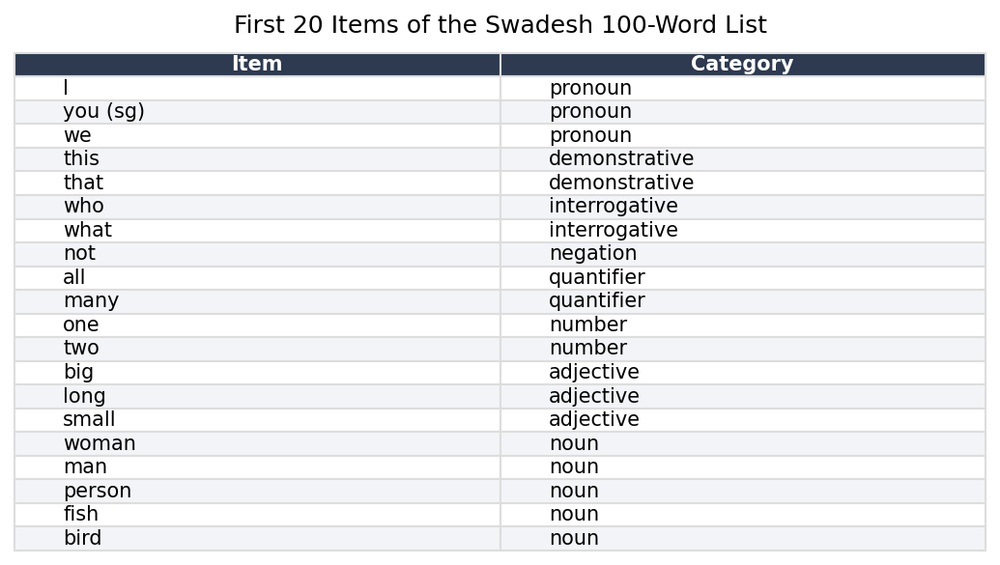
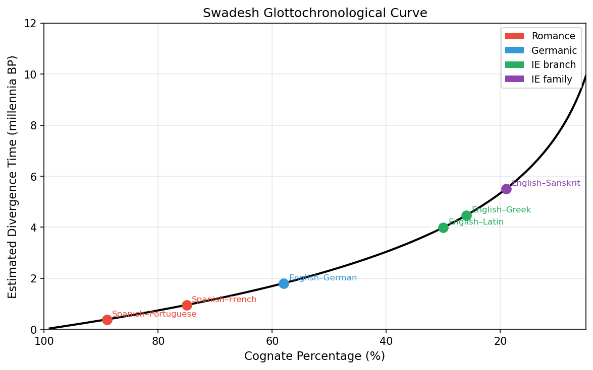
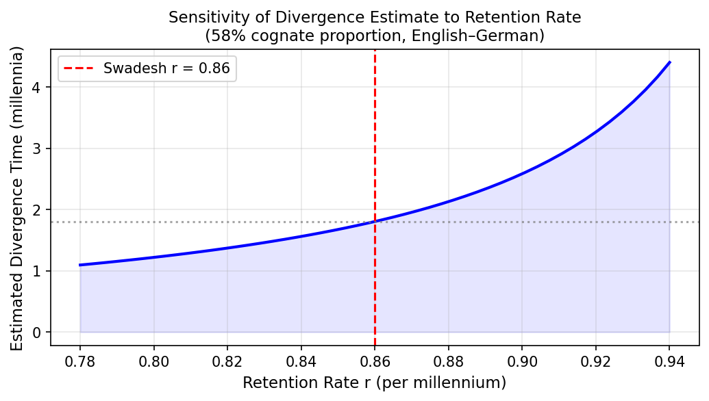

# Glottochronology: Dating Language Divergence {#sec-glottochronology}

```{python}
#| echo: false
import numpy as np
import pandas as pd
import matplotlib.pyplot as plt
import matplotlib.ticker as ticker
from itertools import combinations
```

::: {.callout-note}
## Learning Objectives

By the end of this chapter, you will be able to:

- Explain the core hypothesis of glottochronology and where it comes from
- Apply the Swadesh formula to estimate divergence time from cognate counts
- Implement a basic glottochronological calculator in Python
- Describe the principal criticisms of constant-rate models
- Distinguish classical glottochronology from modern Bayesian phylogenetic dating
- Interpret divergence time estimates with appropriate uncertainty
:::

## The Clock in the Vocabulary

In 1952, Morris Swadesh, an American linguist with an unusually quantitative turn of mind, proposed something that struck most of his colleagues as either brilliant or absurd, depending on their disposition toward mathematics. Languages, he argued, lose basic vocabulary at a roughly constant rate. Not all vocabulary — not the technical terms, the slang, the borrowed words — but a specific core list of concepts so fundamental to human experience that every language has words for them and almost none have reason to replace them quickly. If this rate were truly constant, then counting how many words two related languages still shared from this core list would let you calculate when they parted ways, just as counting the remaining atoms of carbon-14 in an organic sample lets you calculate when the organism died.

Swadesh was proposing, in effect, a linguistic molecular clock.

The analogy to radiocarbon dating is instructive and, like all analogies, imperfect. Carbon-14 decays at a rate governed by quantum mechanics — a rate that does not depend on temperature, pressure, chemistry, or the history of the sample. Vocabulary replacement is governed by culture, contact, prestige, war, and a hundred other contingencies. The question Glottochronology asks — and seventy years of subsequent work has answered only partially — is whether, despite all this noise, the average rate is stable enough to be useful.

---

## The Swadesh List

The foundation of glottochronology is the Swadesh list: a set of concepts chosen specifically for their universality and resistance to borrowing. Swadesh's original 1952 list had 215 items; he revised it to 200, then to 100. The 100-item list has become the standard for computational work because it is more carefully curated and shows better cross-linguistic stability.

The criteria for inclusion on the list are stringent. A concept must be:

- **Universal**: every human language has a word for it
- **Concrete**: it refers to something in immediate experience, not an abstraction
- **Resistant to borrowing**: languages rarely adopt foreign words for these concepts
- **Resistant to derivation**: the word is typically a root, not a compound or derivative

The list includes pronouns (I, you, we), body parts (hand, eye, blood, tongue), basic natural phenomena (water, fire, sun, moon, night), elementary actions (to eat, to drink, to die, to come), and basic properties (big, small, new, old, full). It deliberately excludes culturally specific items (plough, king, temple), technical vocabulary (wheel, sword, coin), and anything that might be easily borrowed.

```{python}
#| echo: false
swadesh_100 = [
    "I", "you (sg)", "we", "this", "that", "who", "what",
    "not", "all", "many", "one", "two", "big", "long", "small",
    "woman", "man", "person", "fish", "bird", "dog", "louse", "tree",
    "seed", "leaf", "root", "bark", "skin", "flesh", "blood",
    "bone", "grease", "egg", "horn", "tail", "feather", "hair",
    "head", "ear", "eye", "nose", "mouth", "tooth", "tongue",
    "claw", "foot", "knee", "hand", "belly", "neck", "breasts",
    "heart", "liver", "drink", "eat", "bite", "see", "hear",
    "know", "sleep", "die", "kill", "swim", "fly", "walk",
    "come", "lie", "sit", "stand", "give", "say", "sun", "moon",
    "star", "water", "rain", "stone", "sand", "earth", "cloud",
    "smoke", "fire", "ash", "burn", "road", "mountain", "red",
    "green", "yellow", "white", "black", "night", "hot", "cold",
    "full", "new", "good", "round", "dry", "name"
]

# Display a sample
sample_df = pd.DataFrame({
    'Item': swadesh_100[:20],
    'Category': ['pronoun']*3 + ['demonstrative']*2 + ['interrogative']*2 +
                ['negation','quantifier','quantifier','number','number'] +
                ['adjective']*3 + ['noun']*5
})

fig, ax = plt.subplots(figsize=(7, 4))
ax.axis('off')
tbl = ax.table(
    cellText=sample_df.values,
    colLabels=sample_df.columns,
    cellLoc='left',
    loc='center',
    bbox=[0, 0, 1, 1]
)
tbl.auto_set_font_size(False)
tbl.set_fontsize(10)
for (row, col), cell in tbl.get_celld().items():
    if row == 0:
        cell.set_facecolor('#2d3a50')
        cell.set_text_props(color='white', fontweight='bold')
    elif row % 2 == 0:
        cell.set_facecolor('#f2f4f8')
    cell.set_edgecolor('#dddddd')
plt.title('First 20 Items of the Swadesh 100-Word List', fontsize=12, pad=10)
plt.tight_layout()
plt.savefig('docs/glottochronology_swadesh_sample.png', dpi=150, bbox_inches='tight')
plt.close()
```



The words on the list are not translations of English into other languages — they are instantiations of the *concept* in each language's own vocabulary. The English word for HAND is *hand*. The corresponding word in classical Latin is *manus*. In Proto-Germanic, the reconstructed form is *\*handuz*. These are cognates — different reflexes of the same ancestral word — and they count as a match in the glottochronological comparison. The French *main* (also from *manus*) and the English *hand* (from *\*handuz*) are not cognates and count as a non-match, reflecting the split between the Romance and Germanic branches of Indo-European.

---

## The Basic Formula

Swadesh's core claim was that the basic vocabulary items in his list are replaced at a rate of approximately 14% per thousand years — meaning that after 1000 years, a language retains about 86% of its original core vocabulary, having replaced the other 14% with new or borrowed words. After 2000 years, it retains roughly $0.86^2 \approx 74\%$. After 5000 years, roughly $0.86^5 \approx 47\%$.

If two daughter languages descended from a common ancestor and each lost vocabulary at this rate independently, the proportion of cognates they share at time $t$ (measured in millennia since their split) is:

$$C(t) = r^{2t}$$

where $r$ is the retention rate per millennium ($r \approx 0.86$ in Swadesh's original estimate) and $t$ is the elapsed time in thousands of years. The factor of 2 in the exponent appears because both languages have been diverging for time $t$, each independently replacing vocabulary.

Inverting this equation to solve for $t$ given an observed cognate percentage $C$:

$$t = \frac{\log C}{2 \log r}$$

This is the Swadesh glottochronological formula. Given two related languages and a count of how many of the 100 Swadesh items are cognates, you can estimate when they split.

```{python}
#| echo: false

r = 0.86  # Swadesh retention rate per millennium

def glottochronology_time(C, r=0.86):
    """Estimate divergence time in millennia from cognate proportion C."""
    if C <= 0 or C >= 1:
        return np.nan
    return np.log(C) / (2 * np.log(r))

# Generate the curve
cognate_pct = np.linspace(0.05, 0.99, 300)
times = np.array([glottochronology_time(c, r) for c in cognate_pct])

# Mark some real language pairs (approximate cognate % from literature)
real_pairs = {
    'Spanish–Portuguese': (0.89, 'Romance'),
    'Spanish–French': (0.75, 'Romance'),
    'English–German': (0.58, 'Germanic'),
    'English–Latin': (0.30, 'IE branch'),
    'English–Greek': (0.26, 'IE branch'),
    'English–Sanskrit': (0.19, 'IE family'),
}

colors = {'Romance': '#e74c3c', 'Germanic': '#3498db', 'IE branch': '#27ae60', 'IE family': '#8e44ad'}

fig, ax = plt.subplots(figsize=(8, 5))
ax.plot(cognate_pct * 100, times, 'k-', linewidth=2, label='Swadesh formula (r = 0.86)')

for label, (c, cat) in real_pairs.items():
    t = glottochronology_time(c, r)
    ax.scatter(c * 100, t, color=colors[cat], s=80, zorder=5)
    ax.annotate(label, xy=(c * 100, t), xytext=(5, 3),
                textcoords='offset points', fontsize=8, color=colors[cat])

ax.set_xlabel('Cognate Percentage (%)', fontsize=11)
ax.set_ylabel('Estimated Divergence Time (millennia BP)', fontsize=11)
ax.set_title('Swadesh Glottochronological Curve', fontsize=12)
ax.invert_xaxis()
ax.grid(True, alpha=0.3)
ax.set_xlim(100, 5)
ax.set_ylim(0, 12)

# Add secondary labels
from matplotlib.patches import Patch
legend_elements = [Patch(facecolor=v, label=k) for k, v in colors.items()]
ax.legend(handles=legend_elements, loc='upper right', fontsize=9)

plt.tight_layout()
plt.savefig('docs/glottochronology_curve.png', dpi=150, bbox_inches='tight')
plt.close()
```



---

## Implementing Glottochronology in Python

The calculation itself is straightforward. The difficulty lies in the data: obtaining reliable cognate judgments for the 100 Swadesh items across the language pairs of interest.

```{python}
#| echo: true

import numpy as np

def glotto_time(n_cognates: int, n_total: int = 100, r: float = 0.86) -> float:
    """
    Estimate divergence time using the Swadesh formula.

    Parameters
    ----------
    n_cognates : int
        Number of cognate pairs identified in the Swadesh list.
    n_total : int
        Total number of Swadesh items compared (default 100).
    r : float
        Retention rate per millennium (default 0.86, Swadesh original).

    Returns
    -------
    float
        Estimated time of divergence in thousands of years BP.
    """
    C = n_cognates / n_total
    if C <= 0 or C >= 1:
        raise ValueError("Cognate proportion must be strictly between 0 and 1.")
    return np.log(C) / (2 * np.log(r))


def glotto_ci(n_cognates: int, n_total: int = 100,
              r: float = 0.86, alpha: float = 0.05) -> tuple:
    """
    Approximate confidence interval for divergence time using
    the binomial standard error on the cognate proportion.

    Returns (lower_bound, point_estimate, upper_bound) in millennia.
    """
    from scipy import stats

    C = n_cognates / n_total
    se = np.sqrt(C * (1 - C) / n_total)
    z = stats.norm.ppf(1 - alpha / 2)

    C_lo = max(C - z * se, 0.01)
    C_hi = min(C + z * se, 0.99)

    t_point = glotto_time(n_cognates, n_total, r)
    t_lo    = np.log(C_hi) / (2 * np.log(r))   # more cognates → more recent
    t_hi    = np.log(C_lo) / (2 * np.log(r))   # fewer cognates → more ancient

    return (t_lo, t_point, t_hi)


# Example: English vs German — approximately 58 cognates out of 100
pairs = {
    'Spanish–Portuguese': 89,
    'Spanish–French':     75,
    'English–German':     58,
    'English–Latin':      30,
    'English–Sanskrit':   19,
}

print(f"{'Language Pair':<25} {'Cognates':>8} {'t (ka)':>8} {'95% CI':>20}")
print("-" * 65)
for pair, n in pairs.items():
    lo, t, hi = glotto_ci(n)
    print(f"{pair:<25} {n:>8}    {t:>6.2f}    ({lo:.2f} – {hi:.2f})")
```

The output makes the method's limitations immediately visible. The 95% confidence interval for English–German (58 cognates) spans several hundred years on either side of the point estimate — and that uncertainty assumes the *only* source of error is sampling noise in the cognate count. In reality, the cognate judgments themselves are uncertain, the retention rate is not fixed, and the model is misspecified. The true uncertainty is considerably larger.

---

## The Retention Rate Problem

The most fundamental criticism of classical glottochronology is that the retention rate is not constant. Swadesh's $r = 0.86$ was estimated from a small set of languages with known historical divergence dates — languages like Romance (split from Latin in a datable period) and the modern Germanic languages. Applying the same rate universally assumes that Polynesian languages, Bantu languages, and Tibeto-Burman languages lose core vocabulary at the same speed as the Indo-European languages used to calibrate the formula.

They do not. Estimated retention rates from well-dated language pairs cluster around 0.80 to 0.92, a range wide enough to produce wildly different divergence estimates. If the true retention rate for a given language family is 0.80 rather than 0.86, the formula will systematically overestimate divergence times. If it is 0.92, it will underestimate them.

```{python}
#| echo: false

# Show how sensitive the estimate is to retention rate
cognate_pct = 0.58  # English vs German
rates = np.linspace(0.78, 0.94, 50)
times = [np.log(cognate_pct) / (2 * np.log(r)) for r in rates]

fig, ax = plt.subplots(figsize=(7, 4))
ax.plot(rates, times, 'b-', linewidth=2)
ax.axvline(0.86, color='r', linestyle='--', label='Swadesh r = 0.86')
ax.axhline(np.log(cognate_pct) / (2 * np.log(0.86)), color='gray',
           linestyle=':', alpha=0.7)
ax.fill_between(rates, times, alpha=0.1, color='blue')
ax.set_xlabel('Retention Rate r (per millennium)', fontsize=11)
ax.set_ylabel('Estimated Divergence Time (millennia)', fontsize=11)
ax.set_title(f'Sensitivity of Divergence Estimate to Retention Rate\n(58% cognate proportion, English–German)', fontsize=11)
ax.legend()
ax.grid(True, alpha=0.3)
plt.tight_layout()
plt.savefig('docs/glottochronology_sensitivity.png', dpi=150, bbox_inches='tight')
plt.close()
```



A second criticism targets the independence assumption. The formula assumes that vocabulary replacement in the two daughter languages is statistically independent after the split. In practice, languages that separated geographically but remained in contact — through trade, migration, or conquest — will show artificially elevated cognate counts, pushing the estimated divergence time toward the present. Conversely, languages that experienced rapid cultural upheaval (conquest, mass bilingualism, prestige contact) may lose basic vocabulary faster than the model predicts, pushing estimated divergence times into the past.

A third, more subtle criticism is that cognate identification is itself theory-laden and error-prone. Two words are cognates if and only if they descend from the same ancestral form — not merely if they sound similar. The German *Vater* and English *father* are cognates (both from Proto-Germanic *\*fadēr*, itself from PIE *\*ph₂tḗr*). The English *much* and the German *mächtig* (powerful) look similar and share an ancestor, but they are not cognates of each other in the relevant sense — they descended through different semantic paths from the same root. Expert cognate judgments disagree at rates of 10–20% on difficult cases, introducing systematic bias whose direction is hard to assess.

---

## Bayesian Phylogenetic Dating: The Modern Approach

The contemporary response to classical glottochronology's weaknesses is Bayesian phylogenetic dating, pioneered in linguistics by Russell Gray and Quentin Atkinson in a landmark 2003 paper in *Nature* that estimated the age of the Indo-European language family using methods adapted from evolutionary biology.

Rather than assuming a fixed retention rate and deriving a point estimate, Bayesian dating places a prior distribution over the tree topology, the branch lengths, and the substitution rate, and then uses Markov Chain Monte Carlo (MCMC) sampling to estimate the posterior distribution over all parameters simultaneously. The result is not a single number but a full probability distribution over possible divergence times — a distribution that properly propagates all sources of uncertainty.

The key innovations in the Bayesian approach are:

**Rate relaxation.** Instead of a single global retention rate, the Bayesian model allows each branch of the phylogenetic tree to have its own rate, drawn from a common prior distribution. This is the "relaxed clock" model, directly analogous to the relaxed molecular clock used in genomic phylogenetics. Languages that underwent rapid change get longer branch lengths; languages that changed slowly get shorter ones. The model learns the rate distribution from the data rather than assuming it.

**Calibration constraints.** Rather than calibrating the clock from a single assumed rate, Bayesian dating incorporates multiple *calibration points* — language pairs or nodes in the tree whose divergence time is known from historical records, inscriptions, or archaeological evidence. The Romance languages provide a calibration: they diverged from Latin after the fall of the Western Roman Empire, giving a hard minimum bound of roughly 1500 years. The Germanic languages provide another. Each calibration constrains the model independently, and the posterior integrates all of them.

**Topological uncertainty.** Classical glottochronology assumes the tree topology is known. Bayesian methods treat the topology as an unknown parameter and sample over all possible trees, weighted by how well they fit the data. The resulting estimate of divergence time averages over topological uncertainty rather than conditioning on a single assumed tree.

The Gray and Atkinson analysis, using 87 Indo-European languages and 2449 cognate sets, estimated the age of Proto-Indo-European at approximately 8500 years before present, supporting the Anatolian origin hypothesis over the competing Pontic-steppe hypothesis (which would require an age of 5000–6000 years). The result was controversial — the steppe hypothesis remains the majority view among archaeologists — but the methodological advance was unambiguous. Bayesian phylogenetic dating replaced a single number with a credible interval, replaced a fixed rate with a learned distribution, and replaced topological assumption with topological inference.

```{python}
#| echo: false

# Simulate what a Bayesian posterior over divergence time looks like
# vs the single point from classical glottochronology
from scipy.stats import norm, gamma

np.random.seed(42)

# Classical point estimate for English-German
C_obs = 0.58
t_classical = np.log(C_obs) / (2 * np.log(0.86))

# Simulate a "Bayesian" posterior — wider, shifted slightly
# (illustrative; not a real MCMC result)
posterior_samples = np.random.normal(loc=t_classical * 1.08, scale=0.6, size=10000)
posterior_samples = posterior_samples[posterior_samples > 0]

t_grid = np.linspace(0, 8, 300)

fig, ax = plt.subplots(figsize=(8, 4.5))

# Posterior distribution (illustrative)
ax.hist(posterior_samples, bins=60, density=True, alpha=0.55,
        color='steelblue', label='Bayesian posterior (illustrative)')

# Classical point estimate
ax.axvline(t_classical, color='r', linewidth=2, linestyle='--',
           label=f'Classical estimate: {t_classical:.2f} ka')

# 95% credible interval
ci_lo, ci_hi = np.percentile(posterior_samples, [2.5, 97.5])
ax.axvspan(ci_lo, ci_hi, alpha=0.15, color='steelblue',
           label=f'95% credible interval: {ci_lo:.1f}–{ci_hi:.1f} ka')

ax.set_xlabel('Divergence Time (millennia BP)', fontsize=11)
ax.set_ylabel('Probability Density', fontsize=11)
ax.set_title('Classical vs Bayesian Divergence Time Estimates\n(English–German, illustrative)', fontsize=11)
ax.legend(fontsize=9)
ax.grid(True, alpha=0.3)
plt.tight_layout()
plt.savefig('docs/glottochronology_bayesian.png', dpi=150, bbox_inches='tight')
plt.close()
```


---

## What the Numbers Actually Mean

Even a well-calibrated Bayesian divergence time estimate does not answer the question most people think it answers. A divergence time of 1500 years for English and German does not mean that their speakers stopped understanding each other 1500 years ago. Proto-Germanic speakers were already differentiating into Proto-West-Germanic and Proto-North-Germanic dialects long before the historical dates we can pin down. The divergence time estimated by any method is the time since the *most recent common ancestor* of the two languages — a point that is itself a reconstruction, not an observable event.

More importantly, divergence of linguistic lineages is not the same as separation of populations. Languages can diverge while their speakers remain in contact; they can also converge while their speakers are geographically separated (through shared prestige norms, religious texts, or broadcast media). The linguistic clock runs at a rate determined by cultural and social dynamics, not by geography or genetics.

The practical value of glottochronological methods — classical or Bayesian — is not that they give precise calendar dates. It is that they provide *relative ordering* information (this split is older than that one) and *rough scale* information (this family is ancient enough to have predated the development of agriculture; that one is young enough to postdate Roman conquest). Within those limits, used alongside archaeological and genetic evidence, they are genuinely useful tools for reconstructing the deep human past.

---

## Summary

Glottochronology uses the rate of replacement in core vocabulary — operationalized through the Swadesh 100-word list — to estimate when two related languages diverged from their common ancestor. The Swadesh formula $t = \log C / (2 \log r)$ converts an observed cognate proportion $C$ into a divergence time in millennia, assuming a fixed retention rate $r \approx 0.86$. The method is simple to implement and provides useful first-order estimates, but it is sensitive to the assumed retention rate, violated by language contact, and undermined by the inherent uncertainty in cognate identification. Modern Bayesian phylogenetic dating addresses these weaknesses by treating the retention rate as a learnable parameter, incorporating multiple calibration constraints from historical evidence, and producing full posterior distributions over divergence time rather than point estimates. The result is not certainty — language history is too contingent for that — but calibrated uncertainty, which is the honest epistemic state of anyone doing quantitative historical linguistics.
